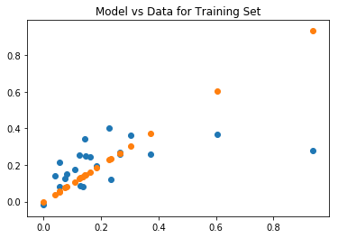
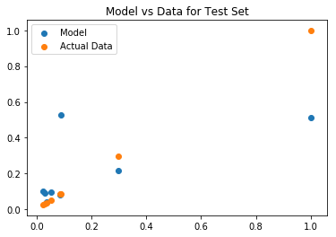
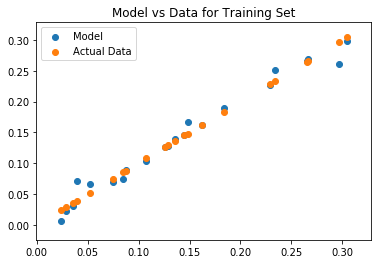
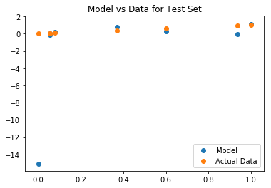

# Bias Variance Tradeoff + More Overfitting

When modelling, we are trying to create a useful prediction that can help us in the future. When doing this, we have seen how we need to create a train test split in order to keep ourselves honest in tuning our model to the data itself. Another perspective on this problem of overfitting versus underfitting is the bias variance tradeoff. We can decompose the mean squared error of our models in terms of bias and variance to further investigate.

$ E[(y-\hat{f}(x)^2] = Bias(\hat{f}(x))^2 + Var(\hat{f}(x)) + \sigma^2$
  
  
$Bias(\hat{f}(x)) = E[\hat{f}(x)-f(x)]$  
$Var(\hat{f}(x)) = E[\hat{f}(x)^2] - \big(E[\hat{f}(x)]\big)^2$


## 1. Split the data into a test and train set.


```python
import pandas as pd
df = pd.read_excel('./movie_data_detailed_with_ols.xlsx')
def norm(col):
    minimum = col.min()
    maximum = col.max()
    return (col-minimum)/(maximum-minimum)
for col in df:
    try:
        df[col] = norm(df[col])
    except:
        pass
X = df[['budget','imdbRating','Metascore','imdbVotes']]
y = df['domgross']
df.head()
```


<div>
<style scoped>
    .dataframe tbody tr th:only-of-type {
        vertical-align: middle;
    }

    .dataframe tbody tr th {
        vertical-align: top;
    }

    .dataframe thead th {
        text-align: right;
    }
</style>
<table border="1" class="dataframe">
  <thead>
    <tr style="text-align: right;">
      <th></th>
      <th>budget</th>
      <th>domgross</th>
      <th>title</th>
      <th>Response_Json</th>
      <th>Year</th>
      <th>imdbRating</th>
      <th>Metascore</th>
      <th>imdbVotes</th>
      <th>Model</th>
    </tr>
  </thead>
  <tbody>
    <tr>
      <th>0</th>
      <td>0.034169</td>
      <td>0.055325</td>
      <td>21 &amp;amp; Over</td>
      <td>NaN</td>
      <td>0.997516</td>
      <td>0.839506</td>
      <td>0.500000</td>
      <td>0.384192</td>
      <td>0.261351</td>
    </tr>
    <tr>
      <th>1</th>
      <td>0.182956</td>
      <td>0.023779</td>
      <td>Dredd 3D</td>
      <td>NaN</td>
      <td>0.999503</td>
      <td>0.000000</td>
      <td>0.000000</td>
      <td>0.000000</td>
      <td>0.070486</td>
    </tr>
    <tr>
      <th>2</th>
      <td>0.066059</td>
      <td>0.125847</td>
      <td>12 Years a Slave</td>
      <td>NaN</td>
      <td>1.000000</td>
      <td>1.000000</td>
      <td>1.000000</td>
      <td>1.000000</td>
      <td>0.704489</td>
    </tr>
    <tr>
      <th>3</th>
      <td>0.252847</td>
      <td>0.183719</td>
      <td>2 Guns</td>
      <td>NaN</td>
      <td>1.000000</td>
      <td>0.827160</td>
      <td>0.572917</td>
      <td>0.323196</td>
      <td>0.371052</td>
    </tr>
    <tr>
      <th>4</th>
      <td>0.157175</td>
      <td>0.233625</td>
      <td>42</td>
      <td>NaN</td>
      <td>1.000000</td>
      <td>0.925926</td>
      <td>0.645833</td>
      <td>0.137984</td>
      <td>0.231656</td>
    </tr>
  </tbody>
</table>
</div>


```python
#Your code here
from sklearn.model_selection import train_test_split
X_train , X_test, y_train, y_test = train_test_split(X, y)
```

## 2. Fit a regression model to the training data.


```python
#Your code here
from sklearn.linear_model import *
```


```python
linreg = LinearRegression()
```


```python
linreg.fit(X_train, y_train)
```


    LinearRegression(copy_X=True, fit_intercept=True, n_jobs=1, normalize=False)


```python
import matplotlib.pyplot as plt
%matplotlib inline
```


```python
plt.scatter(y_train, linreg.predict(X_train), label='Model')
plt.scatter(y_train, y_train, label='Actual Data')
plt.title('Model vs Data for Training Set')
```


    Text(0.5,1,'Model vs Data for Training Set')





```python
linreg = LinearRegression()
linreg.fit(X_train, y_train)
plt.scatter(y_test, linreg.predict(X_test), label='Model')
plt.scatter(y_test, y_test, label='Actual Data')
plt.legend()
plt.title('Model vs Data for Test Set')
```


    Text(0.5,1,'Model vs Data for Test Set')





## 3. Calculating Bias
Write a formula to calculate the bias of a models predictions given the actual data.   
(The expected value can simply be taken as the mean or average value.)  
$Bias(\hat{f}(x)) = E[\hat{f}(x)-f(x)]$  


```python
import numpy as np
```


```python
def bias(y, y_hat):
    return np.mean(y_hat - y)
```

## 4. Calculating Variance
Write a formula to calculate the variance of a model's predictions (or any set of data).  
$Var(\hat{f}(x)) = E[\hat{f}(x)^2] - \big(E[\hat{f}(x)]\big)^2$


```python
def variance(y_hat):
    return np.mean([yi**2 for yi in y_hat]) - np.mean(y_hat)**2 #Your code here
```

## 5. Us your functions to calculate the bias and variance of your model. Do this seperately for the train and test sets.


```python
b = bias(y_train, linreg.predict(X_train)) #Your code here
v = variance(linreg.predict(X_train)) #Your code here
print('Bias: {} \nVariance: {}'.format(b,v))
```

    Bias: -6.371166220860273e-17 
    Variance: 0.0027257206584798514


```python
b = bias(y_test, linreg.predict(X_test)) #Your code here
v = variance(linreg.predict(X_test)) #Your code here
print('Bias: {} \nVariance: {}'.format(b,v))
```

    Bias: -0.24664654755073653 
    Variance: 0.00989239204558029


## 6. Describe in words what these numbers can tell you.

The training set had far less bias (was more accurate) then the test set.
The test set also had more variance

## 7. Overfit a new model by creating additional features by raising current features to various powers.


```python
def add_polynomial_features(X, powers_to_add, max_features):
    orig_columns = X.columns
    for feat in orig_columns:
        for i in powers_to_add:
            X['{}^{}'.format(feat, i)] = X[feat].map(lambda x: x**i)
            if len(X.columns) >= max_features:
                break
        if len(X.columns) >= max_features:
            break
    return X
```


```python
X_train = add_polynomial_features(X_train, range(2,6), max_features=25)
X_test = add_polynomial_features(X_test, range(2,6), max_features=25)
```

    /Users/matthew.mitchell/anaconda3/lib/python3.6/site-packages/ipykernel_launcher.py:5: SettingWithCopyWarning: 
    A value is trying to be set on a copy of a slice from a DataFrame.
    Try using .loc[row_indexer,col_indexer] = value instead
    
    See the caveats in the documentation: http://pandas.pydata.org/pandas-docs/stable/indexing.html#indexing-view-versus-copy
      """


```python
X_train.head()
```


<div>
<style scoped>
    .dataframe tbody tr th:only-of-type {
        vertical-align: middle;
    }

    .dataframe tbody tr th {
        vertical-align: top;
    }

    .dataframe thead th {
        text-align: right;
    }
</style>
<table border="1" class="dataframe">
  <thead>
    <tr style="text-align: right;">
      <th></th>
      <th>budget</th>
      <th>imdbRating</th>
      <th>Metascore</th>
      <th>imdbVotes</th>
      <th>budget^2</th>
      <th>budget^3</th>
      <th>budget^4</th>
      <th>budget^5</th>
      <th>imdbRating^2</th>
      <th>imdbRating^3</th>
      <th>imdbRating^4</th>
      <th>imdbRating^5</th>
      <th>Metascore^2</th>
      <th>Metascore^3</th>
      <th>Metascore^4</th>
      <th>Metascore^5</th>
      <th>imdbVotes^2</th>
      <th>imdbVotes^3</th>
      <th>imdbVotes^4</th>
      <th>imdbVotes^5</th>
    </tr>
  </thead>
  <tbody>
    <tr>
      <th>12</th>
      <td>0.202733</td>
      <td>0.765432</td>
      <td>0.541667</td>
      <td>0.141391</td>
      <td>0.041101</td>
      <td>0.008333</td>
      <td>0.001689</td>
      <td>0.000342</td>
      <td>0.585886</td>
      <td>0.448456</td>
      <td>0.343263</td>
      <td>0.262744</td>
      <td>0.293403</td>
      <td>0.158927</td>
      <td>0.086085</td>
      <td>0.046629</td>
      <td>0.019991</td>
      <td>0.002827</td>
      <td>0.000400</td>
      <td>0.000057</td>
    </tr>
    <tr>
      <th>14</th>
      <td>0.225513</td>
      <td>0.962963</td>
      <td>0.864583</td>
      <td>0.685073</td>
      <td>0.050856</td>
      <td>0.011469</td>
      <td>0.002586</td>
      <td>0.000583</td>
      <td>0.927298</td>
      <td>0.892953</td>
      <td>0.859881</td>
      <td>0.828034</td>
      <td>0.747504</td>
      <td>0.646280</td>
      <td>0.558763</td>
      <td>0.483097</td>
      <td>0.469325</td>
      <td>0.321522</td>
      <td>0.220266</td>
      <td>0.150899</td>
    </tr>
    <tr>
      <th>5</th>
      <td>1.000000</td>
      <td>0.777778</td>
      <td>0.291667</td>
      <td>0.239554</td>
      <td>1.000000</td>
      <td>1.000000</td>
      <td>1.000000</td>
      <td>1.000000</td>
      <td>0.604938</td>
      <td>0.470508</td>
      <td>0.365950</td>
      <td>0.284628</td>
      <td>0.085069</td>
      <td>0.024812</td>
      <td>0.007237</td>
      <td>0.002111</td>
      <td>0.057386</td>
      <td>0.013747</td>
      <td>0.003293</td>
      <td>0.000789</td>
    </tr>
    <tr>
      <th>2</th>
      <td>0.066059</td>
      <td>1.000000</td>
      <td>1.000000</td>
      <td>1.000000</td>
      <td>0.004364</td>
      <td>0.000288</td>
      <td>0.000019</td>
      <td>0.000001</td>
      <td>1.000000</td>
      <td>1.000000</td>
      <td>1.000000</td>
      <td>1.000000</td>
      <td>1.000000</td>
      <td>1.000000</td>
      <td>1.000000</td>
      <td>1.000000</td>
      <td>1.000000</td>
      <td>1.000000</td>
      <td>1.000000</td>
      <td>1.000000</td>
    </tr>
    <tr>
      <th>18</th>
      <td>0.000000</td>
      <td>0.814815</td>
      <td>0.687500</td>
      <td>0.388722</td>
      <td>0.000000</td>
      <td>0.000000</td>
      <td>0.000000</td>
      <td>0.000000</td>
      <td>0.663923</td>
      <td>0.540974</td>
      <td>0.440794</td>
      <td>0.359165</td>
      <td>0.472656</td>
      <td>0.324951</td>
      <td>0.223404</td>
      <td>0.153590</td>
      <td>0.151105</td>
      <td>0.058738</td>
      <td>0.022833</td>
      <td>0.008876</td>
    </tr>
  </tbody>
</table>
</div>


## 8a. Plot your overfitted model's training predictions against the actual data.


```python
linreg = LinearRegression()
linreg.fit(X_train, y_train)
plt.scatter(y_train, linreg.predict(X_train), label='Model')
plt.scatter(y_train, y_train, label='Actual Data')
plt.legend()
plt.title('Model vs Data for Training Set')
```


    Text(0.5,1,'Model vs Data for Training Set')





## 8b. Calculate the bias and variance for the train set.


```python
b = bias(y_train, linreg.predict(X_train)) #Your code here
v = variance(linreg.predict(X_train)) #Your code here
print('Bias: {} \nVariance: {}'.format(b,v))
```

    Bias: 2.6015174862821636e-14 
    Variance: 0.0074560594809442195


## 9a. Plot your overfitted model's test predictions against the actual data.


```python
linreg = LinearRegression()
linreg.fit(X_train, y_train)
plt.scatter(y_test, linreg.predict(X_test), label='Model')
plt.scatter(y_test, y_test, label='Actual Data')
plt.legend()
plt.title('Model vs Data for Test Set')
```


    Text(0.5,1,'Model vs Data for Test Set')





## 9b. Calculate the bias and variance for the train set.


```python
b = bias(y_test, linreg.predict(X_test)) #Your code here
v = variance(linreg.predict(X_test)) #Your code here
print('Bias: {} \nVariance: {}'.format(b,v))
```

    Bias: -1.997613587950512 
    Variance: 26.02909982221435


## 10. Describe what you notice about the bias and variance statistics for your overfit model.

The bias and variance for the test set both increased drastically in the overfit model.
